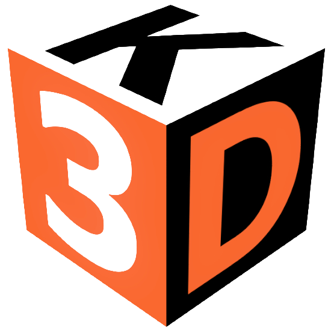

<!-- PROJECT LOGO -->
 

  

  <h3 align="center">Kostka3D</h3>

  

    This is a <b>README</b> of my portfolio website!
     
      <a href="https://kostka3d.github.io/"><strong>Website is avaiable here »</strong></a>
     
  

## About The Project

This project is my attempt to create an useful portfolio for my 3D printing journey. 

It is created by <a href="https://github.com/kosteklvp"><strong>@kosteklvp</strong></a>, which is my personal developer account. This website is based on this template [TXT- HTML5UP](https://html5up.net/txt). 

### Used technologies

This is my second try with web development. I'm learning here:
* HTML,
* CSS,
* JavaScript,
* Visual Studio Code,
* GitHub Pages.

## Contact

You can find me here:  
[![Gmail][gmail-shield]][gmail]
[![Instagram][instagram-shield]][instagram-url]
[![Reddit][reddit-shield]][reddit-url]

[gmail-shield]: https://img.shields.io/badge/Gmail-D14836?style=for-the-badge&logo=gmail&logoColor=white
[gmail]: kostka.druk3d@gmail.com
[reddit-shield]: https://img.shields.io/badge/Reddit-FF4500?style=for-the-badge&logo=reddit&logoColor=white
[reddit-url]: https://www.reddit.com/user/Kostka3D
[instagram-shield]: https://img.shields.io/badge/Instagram-E4405F?style=for-the-badge&logo=instagram&logoColor=white
[instagram-url]: https://www.instagram.com/kostka3d/

## License

This project is licensed under the <a rel="license" href="http://creativecommons.org/licenses/by/4.0/">CC BY 4.0 License</a>.

<!--
This README is based on https://github.com/othneildrew/Best-README-Template. Thanks @othneildrew for your amazing work.
Badges for GitHub: https://dev.to/envoy_/150-badges-for-github-pnk
-->
